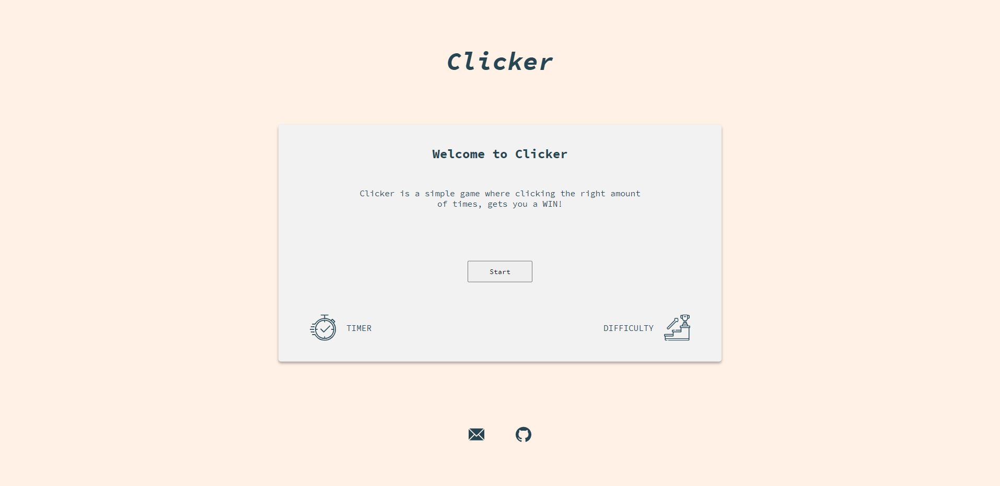
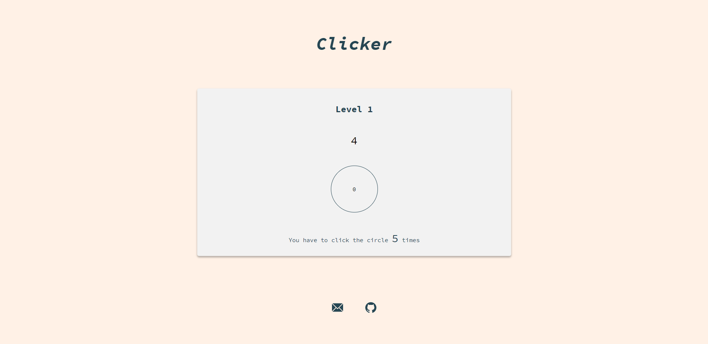
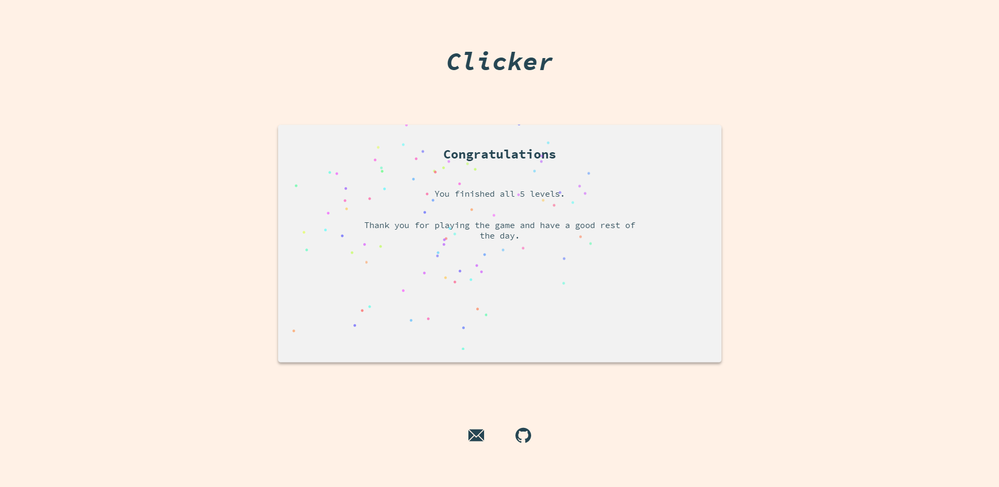

Clicker is a simple game with 5 levels. Every level you get a number, timer and a circle. You have to click a circle X times and before the time runs out. If you fail a level, the game resets. If you win all 5 levels, you celebrate.

## [Live demo](https://zigavidmar.github.io/clicker/)

The game is created with React and typescript.
## Home

## Level

## Finish

